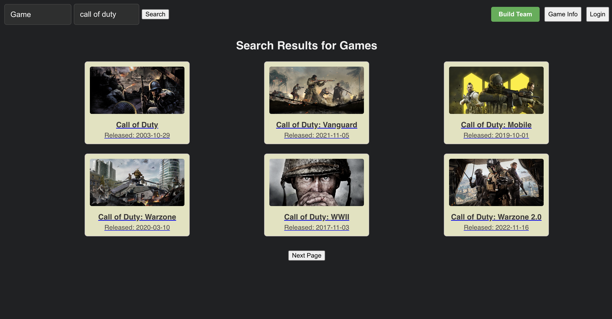
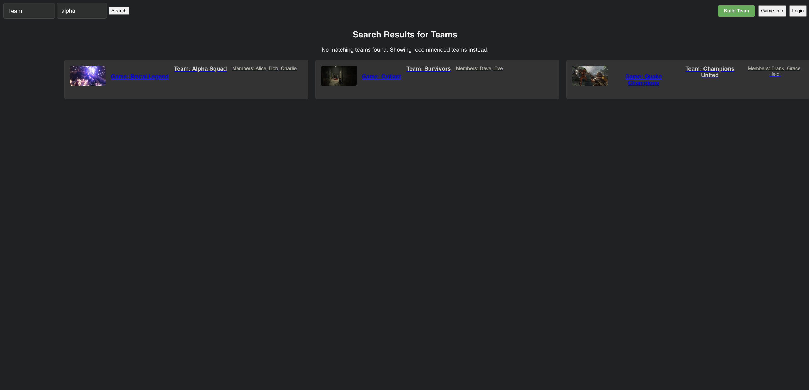

# Game Discovery
This web app is a dynamic platform for gamers designed to streamline the discovery of new games and facilitate team building. Leveraging the RAWG API, the homepage showcases a selection of random games, each of which links to detailed game information pages when clicked. Users can easily search for their favorite games via an intuitive search bar that displays the top 10 matching results, and they can also create, join, and manage gaming teams. With user authentication, profile management, and responsive design, our application offers an engaging and seamless experience for the modern gamer.

## Setup Instructions

### 1. Install Dependencies and Start  the Development Server
```bash
npm install
npm start
```

### 2. Log in or Register
- Create a new account or sign in for a personalized experience.
- Access team building features, saved profiles, and more.

### 3. Begin Exploring
- Check out the Homepage for random game suggestions.
- Use the Search Bar to find specific games or teams.
- Click on any result to access detailed game or team info.

## Homepage


## Login


 The user authentication page, where gamers can securely log in or create an account.

 ## Search Bar
 

 
 
 A dropdown menu for the user to choose whether they want to search for games or teams.

 ## Game Search Results
 

 This page displays the top 12 matching games based on the user’s search query. It is organized with a “Next Page” and “Previous Page” feature that shows 6 games per page. Each game card features the title, release date, and a representative image, allowing users to easily browse, compare, and discover new games.

 ## Team search Results
 

  The eam Search feature allows users to select “Team” from the dropdown menu and enter a keyword. If no exact match is found, three recommended teams are displayed instead. Each team card shows the team’s name, the associated game, and current members, enabling quick identification of potential teams to join.

 ## Game Info
 

 A detailed game info page, featuring key details and providing easy discovery of new gaming adventures.